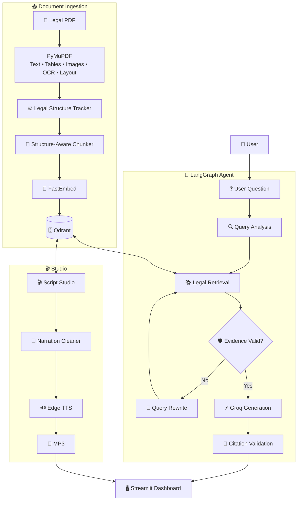

# ⚖️ Legal Agentic RAG Assistant

<p align="center">

### 🧠 AI-Powered Legal Document Intelligence

**Agentic RAG · LangGraph · Groq · Qdrant · Streamlit · FastEmbed · Edge TTS**

A production-style AI assistant for **legal document retrieval, grounded question answering, citation-aware responses, script generation, and voice narration**.

</p>

<p align="center">


</p>

---

## 🌟 What Is This?

**Legal Agentic RAG Assistant** is an AI-powered legal research application designed to answer questions directly from uploaded legal documents.

Instead of asking an LLM to answer from general knowledge, the system:

```text
📄 Legal PDF
     ↓
🔍 Document Extraction
     ↓
🧩 Legal Structure Detection
     ↓
✂️ Structure-Aware Chunking
     ↓
🧠 Local Embeddings
     ↓
🗄️ Qdrant Vector Database
     ↓
🤖 LangGraph Agent
     ↓
🔎 Evidence Retrieval
     ↓
⚡ Groq LLM
     ↓
📚 Deterministic Citations
     ↓
💬 Grounded Answer
```

The application is designed so that answers remain connected to the **retrieved evidence and document metadata**.

---

# ✨ Core Features

| Feature                     | Description                                                |
| --------------------------- | ---------------------------------------------------------- |
| 💬 **Legal Chat**           | Ask questions about indexed legal documents                |
| 🧠 **Agentic RAG**          | LangGraph-powered retrieval and reasoning workflow         |
| 🔎 **Semantic Search**      | Find relevant legal passages using local embeddings        |
| 📚 **Citations**            | Document, Title, Part, Section, page and revision metadata |
| 🛡️ **Evidence Validation** | Detect insufficient evidence before generating answers     |
| 🔄 **Query Rewriting**      | Retry retrieval when evidence is insufficient              |
| 🎬 **Script Studio**        | Generate video scripts from selected legal sections        |
| 🔊 **Voice Studio**         | Convert documents, scripts and text into MP3 narration     |
| 📖 **Knowledge Base**       | Upload, ingest and manage legal PDFs                       |
| 🧪 **Retrieval Playground** | Test retrieval quality before asking questions             |
| 💾 **Conversation Storage** | Save chats and generated responses                         |
| 📤 **Markdown Export**      | Export conversations and answers                           |
| 🗃️ **Rich Metadata**       | Store detailed legal hierarchy and document information    |

---

# 🎨 Streamlit Dashboard

The application provides a professional multi-page dashboard.

### 💬 Chat

Ask legal questions and receive answers grounded in retrieved sources.

Features include:

* Live agent trace
* `[S1]`, `[S2]`, ... source markers
* Evidence cards
* Expandable metadata
* Saved conversations
* Markdown export
* Citation validation

---

### 🎬 Script Studio

Turn legal information into a structured video script.

You can provide:

```text
Topic
```

or a specific section:

```text
§1303.13
```

The script is generated from the relevant PDF evidence rather than unrestricted model knowledge.

---

### 🔊 Voice Studio

Convert:

```text
📄 PDF
📝 TXT
📋 Pasted Text
🎬 Generated Script
```

into:

```text
🔊 MP3 narration
```

Available controls include:

* Language
* Accent
* Speaker
* Voice
* Tone
* Speed
* Pitch
* Volume
* Preview

---

### 📚 Knowledge Base

Manage your legal document collection:

```text
Upload PDF
     ↓
Parse
     ↓
Extract structure
     ↓
Create chunks
     ↓
Generate embeddings
     ↓
Store in Qdrant
     ↓
Ready for retrieval
```

---

# 🧠 Agentic RAG Architecture



---

# 🛡️ Anti-Hallucination Design

The system includes multiple safeguards designed to keep responses grounded in retrieved evidence.

### 1️⃣ Source-Limited Generation

The LLM receives numbered sources:

```text
[S1]
[S2]
[S3]
```

and is instructed to cite the relevant evidence.

### 2️⃣ Deterministic Citations

Citations are constructed in application code from Qdrant metadata rather than being invented by the LLM.

### 3️⃣ Evidence Validation

The system checks whether sufficient evidence was retrieved before generating the final response.

### 4️⃣ Query Retry

If retrieval is insufficient:

```text
Question
   ↓
Retrieve
   ↓
Insufficient Evidence
   ↓
Rewrite Query
   ↓
Retrieve Again
```

### 5️⃣ Section Validation

Legal section numbers mentioned in generated answers can be checked against the retrieved evidence.

### 6️⃣ Revision-Date Awareness

The application preserves the revision date of the source document so users can distinguish an archived document from current law.

---

# 🗂️ Rich Legal Metadata

Each Qdrant vector can contain metadata such as:

### 📄 Document

```text
document_id
document_name
source_file
revision_date
```

### ⚖️ Legal Hierarchy

```text
title
title_name
chapter
chapter_name
subchapter
part
part_name
subpart
subpart_name
section
section_heading
subsection
hierarchy_path
```

### 📍 Location

```text
page
page_start
page_end
bbox
```

### 🧩 Content

```text
element_type
element_types
caption
image_paths
text
char_count
```

### 📊 Bookkeeping

```text
chunk_index
ingested_at
```

---

# 🔊 Voice Studio

Voice generation uses **Microsoft Edge neural voices through `edge-tts`**.

```text
Input Text
    ↓
🧹 Clean Narration
    ↓
🌍 Optional Translation
    ↓
✂️ Split into Parts
    ↓
🔊 Edge Neural Voice
    ↓
🎵 Join Audio
    ↓
MP3
```

### 🎭 Voice Controls

| Tone                    | Speed | Pitch | Volume |
| ----------------------- | ----: | ----: | -----: |
| Neutral                 |    0% |  0 Hz |     0% |
| Calm & Soothing         |  -12% | -2 Hz |    -5% |
| Warm & Friendly         |   -4% | +2 Hz |     0% |
| Energetic               |  +15% | +4 Hz |    +5% |
| Serious / Authoritative |   -8% | -6 Hz |    +5% |
| News Reader             |   +8% |  0 Hz |    +5% |
| Slow & Clear            |  -25% |  0 Hz |     0% |
| Cheerful                |  +10% | +8 Hz |    +5% |
| Storyteller             |  -10% | -3 Hz |     0% |

> Voice tone controls are approximations because `edge-tts` modifies speed, pitch and volume rather than creating genuine emotional states.

---

# 🏗️ Technology Stack

```text
🐍 Python 3.11+
        │
        ├── 🤖 LangGraph
        │
        ├── ⚡ Groq
        │
        ├── 🗄️ Qdrant
        │
        ├── 🧠 FastEmbed
        │
        ├── 📄 PyMuPDF
        │
        ├── 🗃️ SQLite
        │
        ├── 🔊 Edge TTS
        │
        └── 🎨 Streamlit
```

| Layer           | Technology |
| --------------- | ---------- |
| Frontend        | Streamlit  |
| Agent Framework | LangGraph  |
| LLM             | Groq       |
| Vector Database | Qdrant     |
| Embeddings      | FastEmbed  |
| PDF Engine      | PyMuPDF    |
| Database        | SQLite     |
| TTS             | Edge TTS   |
| Testing         | Pytest     |
| Language        | Python     |

---

# 📁 Project Structure

```text
legal-agentic-rag/
│
├── 📱 streamlit_app.py
│
├── app/
│   ├── 🤖 agent/
│   │   ├── citations.py
│   │   ├── graph.py
│   │   ├── nodes.py
│   │   ├── prompts.py
│   │   ├── state.py
│   │   └── tools.py
│   │
│   ├── 📥 ingestion/
│   │   ├── pdf_parser.py
│   │   ├── legal_structure.py
│   │   ├── chunker.py
│   │   └── pipeline.py
│   │
│   ├── 🎨 ui/
│   │   ├── components.py
│   │   └── styles.py
│   │
│   ├── config.py
│   ├── embeddings.py
│   ├── llm.py
│   ├── models.py
│   ├── script_mode.py
│   ├── storage.py
│   ├── vectorstore.py
│   └── voice.py
│
├── data/
│   ├── pdfs/
│   └── sample/
│
├── scripts/
│   ├── ingest.py
│   └── make_sample_pdf.py
│
├── storage/
│
├── tests/
│   ├── test_agent_graph.py
│   ├── test_chunker.py
│   ├── test_citations.py
│   ├── test_legal_structure.py
│   └── test_parser.py
│
├── .env.example
├── .gitignore
├── docker-compose.yml
├── pytest.ini
├── requirements.txt
└── README.md
```

---

# ⚡ Quick Start

## 1. Clone

```bash
git clone <YOUR_REPOSITORY_URL>
cd legal-agentic-rag
```

## 2. Create Virtual Environment

### Windows

```powershell
python -m venv .venv
.\.venv\Scripts\Activate.ps1
```

### Linux / macOS

```bash
python3 -m venv .venv
source .venv/bin/activate
```

## 3. Install Dependencies

```bash
pip install -r requirements.txt
```

## 4. Configure Environment

Copy:

```text
.env.example
```

to:

```text
.env
```

Then configure:

```env
GROQ_API_KEY=your_groq_api_key
```

Never commit your real API key.

## 5. Start the Application

```bash
streamlit run streamlit_app.py
```

Open:

```text
http://localhost:8501
```

---

# 📄 Ingest a Legal PDF

### Using the UI

```text
Knowledge Base
      ↓
Upload PDF
      ↓
Ingest
      ↓
Wait for completion
      ↓
Test Retrieval
```

### Using CLI

```bash
python scripts/ingest.py \
  --pdf "data/pdfs/your_file.pdf" \
  --name "Code of Federal Regulations - Title 21"
```

For scanned documents:

```bash
python scripts/ingest.py \
  --pdf "data/pdfs/your_file.pdf" \
  --name "Your Document" \
  --ocr
```

---

# 🗄️ Qdrant

The project supports local Qdrant storage.

Default local storage:

```text
storage/qdrant
```

For server-based Qdrant:

```bash
docker compose up -d
```

Then configure:

```env
QDRANT_URL=http://localhost:6333
```

> Local Qdrant should not be accessed simultaneously by multiple processes.

---

# 🧪 Testing

Run:

```bash
pytest -v
```

The test suite covers areas including:

```text
🤖 Agent graph
🧩 Chunking
📚 Citations
⚖️ Legal structure
📄 PDF parser
```

Tests can use in-memory components and synthetic documents so that core functionality can be tested without requiring a production API key.

---

# 🧠 Groq Configuration

The application is designed to work with lightweight Groq models.

Example configuration:

```env
GROQ_MODEL=openai/gpt-oss-20b
```

Model availability can change over time, so check the current Groq model catalog before deployment.

For free-tier usage, keep context and token limits controlled to reduce rate-limit issues.

---

# 🔐 Security

Never commit:

```text
.env
API keys
Private PDFs
Private legal documents
Generated private data
.venv/
```

Recommended `.gitignore`:

```gitignore
.env
.venv/
__pycache__/
*.pyc
.pytest_cache/

storage/*
!storage/.gitkeep

data/pdfs/*
!data/pdfs/.gitkeep

outputs/*.mp3
```

---

# 📈 Future Roadmap

### 🔍 Retrieval

* Hybrid keyword + vector search
* Legal reranking
* Better multilingual retrieval
* Advanced document comparison

### 📄 Documents

* Improved OCR
* Advanced table extraction
* Better scanned-PDF support
* Image understanding

### 🤖 Agents

* Multi-agent legal workflows
* Research planning agent
* Citation verification agent
* Document comparison agent

### 🎨 UI

* Advanced analytics dashboard
* Citation highlighting
* PDF page preview
* Evidence timeline
* User authentication

### 🔊 Voice

* Real-time voice conversation
* Speech-to-text
* More language support
* Streaming audio

### ☁️ Deployment

* Docker production deployment
* Cloud Qdrant
* Cloud storage
* Production authentication
* API layer

---

# ⚠️ Legal Disclaimer

This application is an **AI-assisted legal document research tool**.

It is **not a lawyer and does not provide legal advice**.

AI-generated responses can contain errors or omissions. Always verify important information against the original legal document and, where appropriate, consult a qualified legal professional.

The application also preserves the source document's revision date because a historical legal document should not automatically be treated as the current law.

---

# ⭐ Project Highlights

```text
╔════════════════════════════════════════════╗
║       ⚖️ LEGAL AGENTIC RAG ASSISTANT      ║
╠════════════════════════════════════════════╣
║                                            ║
║  🤖 Agentic AI       → LangGraph           ║
║  ⚡ Fast LLM         → Groq                ║
║  🗄️ Vector Search    → Qdrant              ║
║  🧠 Embeddings       → FastEmbed           ║
║  📄 PDF Intelligence → PyMuPDF             ║
║  🎬 Script Studio    → AI Script Creation  ║
║  🔊 Voice Studio     → Edge TTS            ║
║  🎨 UI               → Streamlit           ║
║                                            ║
╚════════════════════════════════════════════╝
```

---

## 👨‍💻 Built With

**Python · LangGraph · Groq · Qdrant · FastEmbed · PyMuPDF · SQLite · Edge TTS · Streamlit**

---

<p align="center">

### ⚖️ Legal Intelligence • 🔎 Evidence Retrieval • 🤖 Agentic AI • 🔊 Voice

**Built for grounded legal-document research**

</p>
